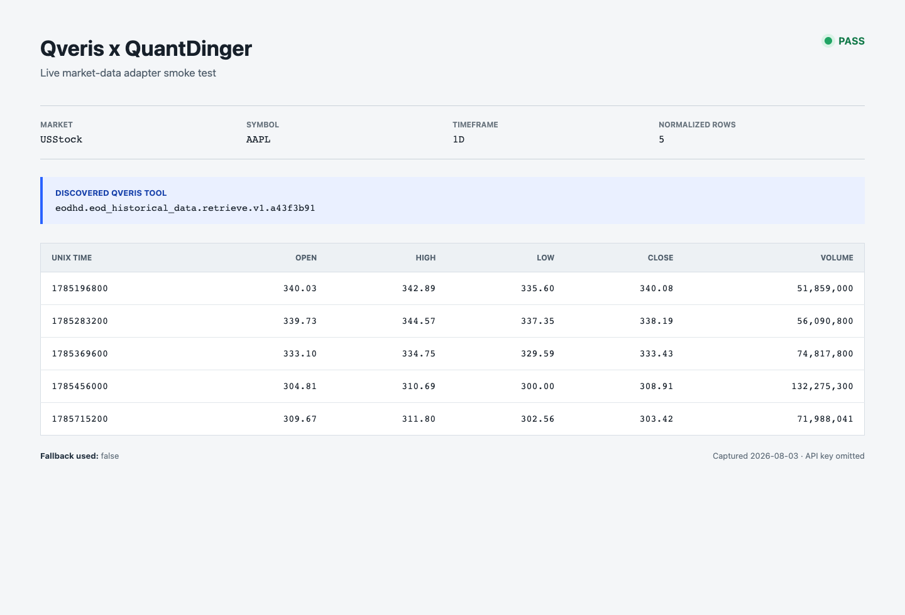

# Qveris Data Source

Qveris can be enabled as an optional, unified market-data layer in front of QuantDinger's existing providers. The integration discovers a compatible read-only Qveris tool, executes it, normalizes common OHLCV or quote response shapes, and falls back to the existing market source when discovery, execution, or normalization fails.

No existing provider is replaced by default.

## Configuration

Add the following values to `backend_api_python/.env`:

```dotenv
QVERIS_API_KEY=your-qveris-api-key
QVERIS_DATA_SOURCE_MARKETS=USStock,CNStock,HKStock
```

Supported market names are `Crypto`, `Forex`, `Futures`, `USStock`, `CNStock`, `HKStock`, and `MOEX`. Use `*` to enable every market.

Optional settings:

```dotenv
QVERIS_BASE_URL=https://qveris.ai/api/v1
QVERIS_TIMEOUT=30
QVERIS_DISCOVERY_TTL_SECONDS=3600
QVERIS_KLINE_TOOL_ID=
QVERIS_TICKER_TOOL_ID=
```

Leave the tool IDs empty to accept the highest-ranked compatible discovery result. Set them when you want to pin a specific tool. A pinned tool must still appear in a fresh Qveris discovery response so that the adapter receives a valid discovery ID.

Restart the backend after changing the environment:

```bash
docker compose up -d --build backend
```

## How Requests Flow

1. `DataSourceFactory` creates the existing QuantDinger provider for the requested market.
2. When a Qveris API key and that market are explicitly configured, the factory wraps the existing provider with `QverisDataSource`.
3. The adapter searches Qveris for a compatible read-only OHLCV or quote tool.
4. It maps common parameters such as symbol, timeframe, limit, and start/end time.
5. It executes the selected tool and normalizes row-oriented, column-oriented, and dated time-series responses.
6. If any step fails, the original provider handles the request.

Discovery results are cached in memory. API keys stay in the backend environment and are never returned to clients or included in logs.

## Verify The Adapter

Run the isolated unit tests, which cover tool discovery, market-aware tool selection, parameter mapping, three common OHLCV response layouts, quote normalization, opt-in behavior, and fallback:

```bash
cd backend_api_python
python -m pytest tests/test_qveris_data_source.py -q
```

Expected result:

```text
8 passed
```

For a live smoke test, start QuantDinger with a valid Qveris key and request data through the existing Agent Gateway:

```bash
curl -sS -G http://localhost:5000/api/agent/v1/klines \
  -H "Authorization: Bearer ${QUANTDINGER_AGENT_TOKEN}" \
  --data-urlencode market=USStock \
  --data-urlencode symbol=AAPL \
  --data-urlencode timeframe=1D \
  --data-urlencode limit=5
```

The public contract remains the existing normalized QuantDinger format:

```json
{
  "code": 0,
  "message": "ok",
  "data": {
    "market": "USStock",
    "symbol": "AAPL",
    "timeframe": "1D",
    "count": 1,
    "klines": [
      {
        "time": 1785542400,
        "open": 100.0,
        "high": 105.0,
        "low": 99.0,
        "close": 104.0,
        "volume": 1200.0
      }
    ]
  }
}
```

The exact upstream tool depends on Qveris discovery and the configured market. Pin a tool ID when reproducibility matters.

## Live Result

The adapter was smoke-tested with `USStock`, `AAPL`, `1D`, and a limit of five. Qveris discovered an end-of-day stock-data tool and returned five rows in QuantDinger's normalized OHLCV format without using the fallback. No API key is included in the image.


